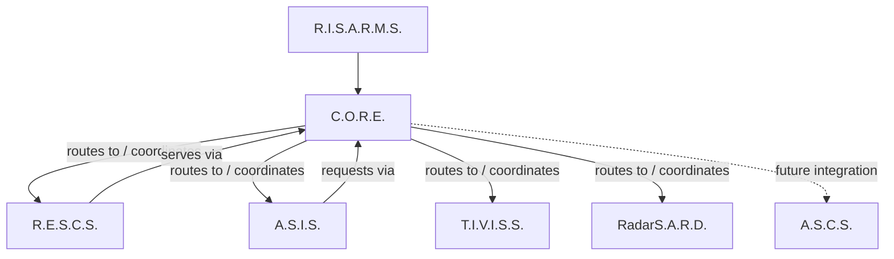

# R.I.S.A.R.M.S. — Architecture & Documentation

> [!NOTE] **Repository role:** This repository is the **architectural source of truth** for the R.I.S.A.R.M.S. ecosystem. It describes what each system is, what it owns, how the systems interact, and what is and is not implemented today. The actual subsystem repositories are the implementation source of truth.

---

## 1. What is R.I.S.A.R.M.S.?

**R.I.S.A.R.M.S.** stands for **R**ishik's **I**ntelligent **S**mart **A**dministration and **R**esource **M**anagement **S**ystem.

R.I.S.A.R.M.S. is the name for the *entire ecosystem* — not a single program. It is a set of modular systems that are independently developed but designed to operate as one coherent whole.

The ecosystem is composed of six systems:

| System | Expansion | Role |
|---|---|---|
| **C.O.R.E.** | Communication, Organization and Resource Engine | Central management, communication, routing and control engine |
| **R.E.S.C.S.** | Rishik's Efficient System for Cloud Storage | Cloud-backed data and file storage |
| **A.S.I.S.** | A Smart Intelligence System | Primary AI / intelligence layer |
| **T.I.V.I.S.S.** | Though I'm Vanquished, I'm Still Stronger | Separate AI agent, designed for eventual handover to another person |
| **RadarS.A.R.D.** | Radar Security, Anomaly Reconnaissance Device | Security and anomaly detection |
| **A.S.C.S.** | A Smart Coding System | Local autonomous coding agent (currently standalone) |

## 2. What this repository contains

This repository is the documentation home of the ecosystem. It contains:

- **Architecture** — the overall design, boundaries, interactions, data flow and lifecycle ([`architecture/`](architecture/overview.md))
- **Per-system reference** — what each system does and owns ([`systems/`](systems/))
- **Interface contracts** — required fields and behavior of communication, messaging, routing, services and integration ([`interfaces/`](interfaces/communication.md))
- **Security architecture** — identity, authentication, authorization and trust boundaries ([`security/`](security/overview.md))
- **Development guidance** — roadmap, versioning, testing and contribution policy ([`development/`](development/roadmap.md))
- **Architecture Decision Records** — the reasoning behind important architectural choices ([`decisions/`](decisions/README.md))

## 3. Ecosystem architecture



The arrows are explained precisely in [System Interactions](architecture/system-interactions.md). The intent is: **all cross-system communication flows through C.O.R.E.**, and C.O.R.E. is the layer that coordinates, routes and manages the ecosystem. An arrow does **not** mean the communication path exists today — statuses are stated per edge.

## 4. Each subsystem at a glance

- **C.O.R.E.** is the central control engine. It owns communication, message protocols, routing, organization, resources, services, runtime/lifecycle, events, dependencies, configuration, health, logging and security infrastructure. It is **not** the primary AI. It runs on the Windows control host and serves external devices. → [systems/core.md](systems/core.md)
- **R.E.S.C.S.** is the cloud/data storage system: persistent records, file/object storage, retrieval, lifecycle/governance and cloud-backed data. It is an **independent project** (`RESCS/` next to `CORE/`, never inside it). → [systems/rescs.md](systems/rescs.md)
- **A.S.I.S.** is the primary AI/intelligence layer: natural-language understanding, reasoning, response generation and voice. It is an **independent project** (`ASIS/` next to `CORE/`). It uses C.O.R.E. (and storage through C.O.R.E.) rather than owning C.O.R.E. responsibilities. → [systems/asis.md](systems/asis.md)
- **T.I.V.I.S.S.** is a separate AI agent with its own identity, configuration, memory, permissions and ownership model — intended to eventually be handed over to another person. It must **not** become a renamed copy of A.S.I.S. Its v0.1.0 foundation is cloned locally at `TIVISS/` but remains foundation-only (no live traffic, no real handover). → [systems/tiviss.md](systems/tiviss.md)
- **RadarS.A.R.D.** is the security/anomaly sensor layer. It detects and reports; C.O.R.E. coordinates the resulting events, logging, health state and responses. → [systems/radar-sard.md](systems/radar-sard.md)
- **A.S.C.S.** is a local autonomous coding agent (Ollama-based). It is fully implemented as a standalone tool and is intended to eventually be usable by A.S.I.S./T.I.V.I.S.S. through C.O.R.E.; no integration exists yet. → [systems/asc.md](systems/asc.md)

## 5. Current development status

> [!NOTE] **Status vocabulary:** The ecosystem uses four explicit statuses throughout these documents: **IMPLEMENTED**, **IN DEVELOPMENT**, **PLANNED**, **FUTURE**. Definitions are in [Architecture Overview](architecture/overview.md#3-status-vocabulary).

| System | Status | Notes |
|---|---|---|
| **C.O.R.E.** | v0.3.0 **IMPLEMENTED** | Full v0.2 phase set completed; v0.3 adds TLS external transport, token authentication, device registration/persistence, device discovery, device-to-device routing, agent scheduling, HTTP R.E.S.C.S. adapter, data distribution and provisioning. Physical Windows ↔ Mac LAN validation and 24/7 operational validation remain **NOT YET PERFORMED**. |
| **R.E.S.C.S.** | v0.3.0 **IMPLEMENTED** | Versioned HTTP API, enforced `X-API-Key` auth, records/files, streaming + resumable uploads, lifecycle/governance, audit, quotas, backup tooling, machine-readable C.O.R.E. contract. Live PostgreSQL/Supabase, real S3 and deployed C.O.R.E. ↔ R.E.S.C.S. interop are **Ready for External Validation**. |
| **A.S.I.S.** | **IN DEVELOPMENT** | Rebuilt `asis` package: CLI, AI provider layer (Ollama), memory, tools, permissions, events, voice pipeline, first test suite. Legacy `core/` + `02_voice/` trees are deprecated and pending removal. C.O.R.E. uplink is a real optional adapter (standalone by default); R.E.S.C.S. remains future. |
| **T.I.V.I.S.S.** | Foundation **IN DEVELOPMENT** (local clone present) | v0.1.0 foundation on GitHub and at `TIVISS/` (identity, ownership states, agent foundation, memory abstraction, adapter interfaces). Still foundation-only; real handover intentionally not implemented. |
| **RadarS.A.R.D.** | **PLANNED / FUTURE** | No code exists anywhere. |
| **A.S.C.S.** | **IMPLEMENTED** (standalone) | v0.3.0 local coding agent (951 passed / 6 skipped 2026-09-23). Zero ecosystem integration today; C.O.R.E.-mediated use by A.S.I.S./T.I.V.I.S.S. is future intent. |

The authoritative per-system detail is in [`systems/`](systems/). **Nothing in this repository describes unbuilt functionality as implemented.**

## 6. C.O.R.E. roadmap state

C.O.R.E. v0.1 established the architecture and behavioral contracts. The **13-phase v0.2 build order is complete** (shipped as v0.2.0 → v0.2.1, with legacy compatibility preserved), and **v0.3.0** layered the external-device platform on top: TLS transport, token authentication, device lifecycle/persistence, agent scheduling, the HTTP R.E.S.C.S. adapter, data distribution and provisioning. Remaining work is deployment validation (physical LAN, 24/7 operation), not software. See [systems/core.md](systems/core.md#6-roadmap).

## 7. Repository structure

```text
RISARMS-DOCS/
│
├── README.md
│
├── architecture/
│   ├── README.md
│   ├── overview.md
│   ├── system-boundaries.md
│   ├── system-interactions.md
│   ├── data-flow.md
│   ├── communication-flow.md
│   └── lifecycle.md
│
├── systems/
│   ├── README.md
│   ├── core.md
│   ├── rescs.md
│   ├── asis.md
│   ├── asc.md
│   ├── tiviss.md
│   └── radar-sard.md
│
├── interfaces/
│   ├── README.md
│   ├── communication.md
│   ├── messaging.md
│   ├── routing.md
│   ├── services.md
│   └── integration-contracts.md
│
├── security/
│   ├── README.md
│   ├── overview.md
│   ├── authentication.md
│   ├── authorization.md
│   └── trust-boundaries.md
│
├── development/
│   ├── README.md
│   ├── roadmap.md
│   ├── versioning.md
│   ├── testing.md
│   └── contribution.md
│
└── decisions/
    ├── README.md
    ├── 0001-rescs-independent-from-core.md
    ├── 0002-asis-independent-from-core.md
    ├── 0003-core-is-integration-layer.md
    ├── 0004-communication-abstraction.md
    ├── 0005-storage-integration-via-adapter.md
    ├── 0006-security-architecture.md
    ├── 0007-ascs-standalone-coding-agent.md
    └── 0008-web-portals-presentation-only.md
```

The ecosystem the documentation governs:

```text
RISARMS/
├── CORE-HOST/      <- https://github.com/Kishir298/CORE-HOST (server/runtime, package `core`)
├── CORE-CLIENT/    <- https://github.com/Kishir298/CORE-CLIENT (stdlib-only external-device client, package `client`)
├── RESCS/          <- https://github.com/Kishir298/RESCS
├── ASIS/           <- https://github.com/Kishir298/ASIS
├── ASCS/           <- https://github.com/Kishir298/ASCS
├── TIVISS/         <- https://github.com/Kishir298/TIVISS (v0.1.0 foundation, local clone present but foundation-only)
└── DOCS/           <- this repository (remote: RISARMS-DOCS)
```

> [!NOTE] **Out-of-scope sibling:** a local-first food companion `Flavora/` may sit beside these directories on a developer machine. It is **not** an ecosystem member and is **not** governed by this architecture — do not infer membership by proximity.

> [!IMPORTANT] **Independence rule:** R.E.S.C.S., A.S.I.S., A.S.C.S. and T.I.V.I.S.S. are independent projects. They live *beside* C.O.R.E., not inside it. Integration happens through defined interfaces and communication contracts, never through code sharing.

## 8. How to use this documentation

This repository is written to be read by **people and by future coding agents**.

- **Start** at [Architecture Overview](architecture/overview.md).
- **For a system's responsibility**, read its page in [`systems/`](systems/).
- **To determine who owns what**, read [System Boundaries](architecture/system-boundaries.md) and [Trust Boundaries](security/trust-boundaries.md).
- **To integrate systems**, read [Interface Contracts](interfaces/communication.md) and [Integration Contracts](interfaces/integration-contracts.md).
- **Before changing anything**, read [Development Contributions](development/contribution.md) and the relevant [Decision Records](decisions/README.md).
- **To know what is allowed to change**, use the status markers: `IMPLEMENTED` functionality is real; `PLANNED`/`FUTURE` functionality is not yet built and must never be described as built.

---

See [Architecture Overview](architecture/overview.md) for the complete architecture, or the system of your choice under [`systems/`](systems/).
