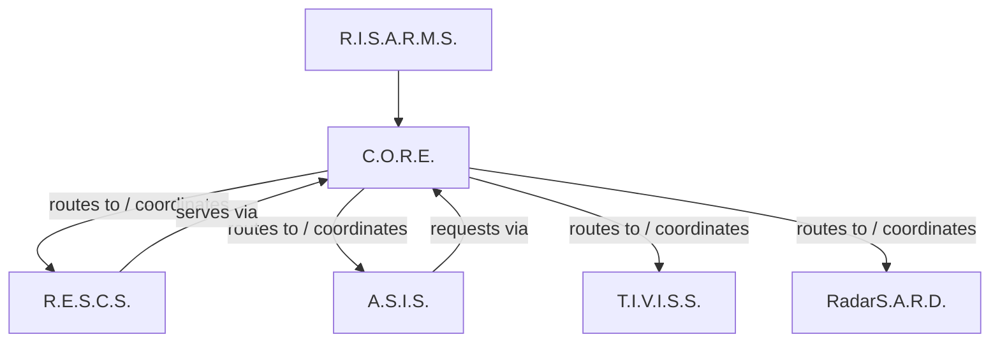

# R.I.S.A.R.M.S. — Architecture & Documentation

> [!NOTE] **Repository role:** This repository is the **architectural source of truth** for the R.I.S.A.R.M.S. ecosystem. It describes what each system is, what it owns, how the systems interact, and what is and is not implemented today.

---

## 1. What is R.I.S.A.R.M.S.?

**R.I.S.A.R.M.S.** stands for **R**ishik's **I**ntelligent **S**mart **A**dministration and **R**esource **M**anagement **S**ystem.

R.I.S.A.R.M.S. is the name for the *entire ecosystem* — not a single program. It is a set of modular systems that are independently developed but designed to operate as one coherent whole.

The ecosystem is composed of five systems:

| System | Expansion | Role |
|---|---|---|
| **C.O.R.E.** | Communication, Organization and Resource Engine | Central management, communication, routing and control engine |
| **R.E.S.C.S.** | Rishik's Efficient System for Cloud Storage | Cloud-backed data and file storage |
| **A.S.I.S.** | A Smart Intelligence System | Primary AI / intelligence layer |
| **T.I.V.I.S.S.** | Though I'm Vanquished, I'm Still Stronger | Separate AI agent, designed for eventual handover to another person |
| **RadarS.A.R.D.** | Radar Security, Anomaly Reconnaissance Device | Security and anomaly detection |

## 2. What this repository contains

This repository is the documentation home of the ecosystem. It contains:

- **Architecture** — the overall design, boundaries, interactions, data flow and lifecycle ([`architecture/`](architecture/overview.md))
- **Per-system reference** — what each system does and owns ([`systems/`](systems/))
- **Interface contracts** — required fields and behavior of communication, messaging, routing, services and integration ([`interfaces/`](interfaces/communication.md))
- **Security architecture** — identity, authentication, authorization and trust boundaries ([`security/`](security/overview.md))
- **Development guidance** — roadmap, versioning, testing and contribution policy ([`development/`](development/roadmap.md))
- **Architecture Decision Records** — the reasoning behind important architectural choices ([`decisions/`](decisions/README.md))

## 3. Ecosystem architecture



The arrows are explained precisely in [System Interactions](architecture/system-interactions.md). The intent is: **all cross-system communication flows through C.O.R.E.**, and C.O.R.E. is the layer that coordinates, routes and manages the ecosystem.

## 4. Each subsystem at a glance

- **C.O.R.E.** is the central control engine. It owns communication, message protocols, routing, organization, resources, services, runtime/lifecycle, events, dependencies, configuration, health, logging and security infrastructure. It is **not** the primary AI. It runs on the control laptop. → [systems/core.md](systems/core.md)
- **R.E.S.C.S.** is the cloud/data storage system: persistent data, file storage, retrieval, synchronization and cloud-backed records. It is an **independent project** (`RESCS/` next to `CORE/`, never inside it). → [systems/rescs.md](systems/rescs.md)
- **A.S.I.S.** is the primary AI/intelligence layer: natural-language understanding, reasoning, response generation and voice. It is an **independent project** (`ASIS/` next to `CORE/`). It uses C.O.R.E. (and storage through C.O.R.E.) rather than owning C.O.R.E. responsibilities. → [systems/asis.md](systems/asis.md)
- **T.I.V.I.S.S.** is a separate AI agent with its own identity, configuration, memory, permissions and ownership model — it is intended to eventually be handed over to another person. It must **not** become a renamed copy of A.S.I.S. → [systems/tiviss.md](systems/tiviss.md)
- **RadarS.A.R.D.** is the security/anomaly sensor layer. It detects and reports; C.O.R.E. coordinates the resulting events, logging, health state and responses. → [systems/radar-sard.md](systems/radar-sard.md)

## 5. Current development status

> [!NOTE] **Status vocabulary:** The ecosystem uses four explicit statuses throughout these documents: **IMPLEMENTED**, **IN DEVELOPMENT**, **PLANNED**, **FUTURE**. Definitions are in [Architecture Overview](architecture/overview.md#3-status-vocabulary).

| System | Status | Notes |
|---|---|---|
| **C.O.R.E.** | v0.1 foundation **IMPLEMENTED**; v0.2 **IN DEVELOPMENT** | All 15 subsystems exist. Several v0.2 phases already landed in git history (transport abstraction, routing-to-service execution, runtime orchestration, events/health integration). |
| **R.E.S.C.S.** | v0.1 **IMPLEMENTED** (phases 1–2) | Health API, record/file repositories, database layer and request-id correlation (`X-Request-ID`) live. Record/file HTTP API, authentication enforcement, object storage and the C.O.R.E. adapter are pending. |
| **A.S.I.S.** | Partial (**IN DEVELOPMENT**) | Interactive chat runtime (Ollama), memory system, tool framework, event bus, a console CLI entry point (`asis`) and an initial test suite — plus a partially implemented voice input pipeline. Voice pipeline not yet integrated into the chat loop; Forza-era naming not yet fully migrated. |
| **T.I.V.I.S.S.** | Early **IN DEVELOPMENT** | A standalone agent codebase now exists (identity, memory, permissions, ownership, handover) with ruff-based tooling. Its long-term handover model is still to be determined. |
| **RadarS.A.R.D.** | **PLANNED** | No code exists. |

The authoritative per-system detail is in [`systems/`](systems/). **Nothing in this repository describes unbuilt functionality as implemented.**

## 6. C.O.R.E. v0.2 roadmap

C.O.R.E. v0.1 established the architecture and behavioral contracts. **C.O.R.E. v0.2 exists to make that architecture genuinely operational.** The v0.2 build order is defined in 13 phases:

| Phase | Focus |
|---|---|
| 1 | Runtime + application orchestration |
| 2 | Communication + transport abstraction |
| 3 | Routing + service execution |
| 4 | Resource + organization integration |
| 5 | Event-driven integration |
| 6 | Health integration |
| 7 | Configuration drives runtime |
| 8 | Security integration |
| 9 | R.E.S.C.S. adapter |
| 10 | External-device transport |
| 11 | Real CLI lifecycle |
| 12 | Full integration test spine |
| 13 | v0.2 cleanup/documentation/release |

Each phase's objective, inputs, outputs, dependencies, completion criteria and "must not implement yet" constraints are specified in [C.O.R.E. v0.2 Roadmap](systems/core.md#6-core-v02-roadmap).

## 7. Repository structure

```text
DOCS/
│
├── README.md
│
├── architecture/
│   ├── overview.md
│   ├── system-boundaries.md
│   ├── system-interactions.md
│   ├── data-flow.md
│   ├── communication-flow.md
│   └── lifecycle.md
│
├── systems/
│   ├── core.md
│   ├── rescs.md
│   ├── asis.md
│   ├── tiviss.md
│   └── radar-sard.md
│
├── interfaces/
│   ├── communication.md
│   ├── messaging.md
│   ├── routing.md
│   ├── services.md
│   └── integration-contracts.md
│
├── security/
│   ├── overview.md
│   ├── authentication.md
│   ├── authorization.md
│   └── trust-boundaries.md
│
├── development/
│   ├── roadmap.md
│   ├── versioning.md
│   ├── testing.md
│   └── contribution.md
│
└── decisions/
    ├── README.md
    ├── 0001-rescs-independent-from-core.md
    ├── 0002-asis-independent-from-core.md
    ├── 0003-core-is-integration-layer.md
    ├── 0004-communication-abstraction.md
    ├── 0005-storage-integration-via-adapter.md
    └── 0006-security-architecture.md
```

The ecosystem the documentation governs:

```text
RISARMS/
├── CORE/
├── RESCS/
├── ASIS/
└── DOCS/   <- this repository
```

> [!IMPORTANT] **Independence rule:** R.E.S.C.S. and A.S.I.S. are independent projects. They live *beside* C.O.R.E., not inside it. Integration happens through defined interfaces and communication contracts, never through code sharing.

## 8. How to use this documentation

This repository is written to be read by **people and by future coding agents**.

- **Start** at [Architecture Overview](architecture/overview.md).
- **For a system's responsibility**, read its page in [`systems/`](systems/).
- **To determine who owns what**, read [System Boundaries](architecture/system-boundaries.md) and [Trust Boundaries](security/trust-boundaries.md).
- **To integrate systems**, read [Interface Contracts](interfaces/communication.md) and [Integration Contracts](interfaces/integration-contracts.md).
- **Before changing anything**, read [Development Contributions](development/contribution.md) and the relevant [Decision Records](decisions/README.md).
- **To know what is allowed to change**, use the status markers: `IMPLEMENTED` functionality is real; `PLANNED`/`FUTURE` functionality is not yet built and must never be described as built.

---

See [Architecture Overview](architecture/overview.md) for the complete architecture, or the system of your choice under [`systems/`](systems/).