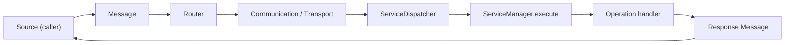

# Communication Flow

> [!NOTE] **Status:** The in-process message path is **IMPLEMENTED** (tested in C.O.R.E.). Transport to other systems and devices is **PLANNED** (v0.2 Phases 9–10).

## Purpose

This document explains **how a message travels** through R.I.S.A.R.M.S., from the contract that describes it ([Messaging](../interfaces/messaging.md)) to the mechanisms that carry it (C.O.R.E.'s communication layer).

## 1. Message path inside C.O.R.E.

Each of these steps exists today (see [core.md](../systems/core.md#42-the-implemented-end-to-end-flow)):

| Step | Component | Notes |
|---|---|---|
| Message creation | `core/communication` | `Message` model carrying type, source, destination, payload |
| Routing | `core/routing.Router` | maps message type → destination; delegates to a `Transport` |
| Delivery | `core/communication.Transport` | abstract; concrete in-process `LocalTransport` |
| Dispatch | `core/services.ServiceDispatcher` | Message → `ServiceRequest` |
| Execution | `core/services.ServiceManager` | runs the operation handler |
| Response | `core/services` | `ServiceResponse` → Message |

## 2. Transport abstraction

The `Transport` interface is the contract every delivery mechanism must satisfy. Today only the in-process `LocalTransport` exists (thread-safe send/request, endpoint registry, counters). Network delivery is **PLANNED**:

- v0.2 **Phase 10** — a transport that reaches external devices.
- v0.2 **Phase 9** — the R.E.S.C.S. adapter rides the communication layer to reach R.E.S.C.S.'s HTTP API.

> [!IMPORTANT] **Transport rule:** callers depend on the `Transport` interface, never on `LocalTransport` directly. Adding a new transport must require implementing the interface only ([ADR 0004](../decisions/0004-communication-abstraction.md)).

## 3. Protocol and serialization

- Messages are serialized as JSON by `MessageSerializer`.
- The message envelope contract (fields, types, IDs) is defined in [Messaging Contract](../interfaces/messaging.md).
- Serialization is transport-independent; outbound adapters will marshal messages into whatever R.E.S.C.S. or device protocols require, at the adapter boundary.

## 4. Failure behavior

Failure behavior is part of the contract, not an afterthought:

- Unknown route / unknown destination → defined error ([Error model](../interfaces/messaging.md#4-errors)).
- Handler failure → isolated, recorded, surfaced as a response error (dispatch guarantees `ServiceResponse`, even on failure).
- Transport failure → a `transport`/`communication` error class; behavior surfaces deterministically rather than silently dropping.

## Related

- [Messaging Contract](../interfaces/messaging.md)
- [Routing Contract](../interfaces/routing.md)
- [Services Contract](../interfaces/services.md)
- [C.O.R.E. system page](../systems/core.md)
- [System Interactions](system-interactions.md)