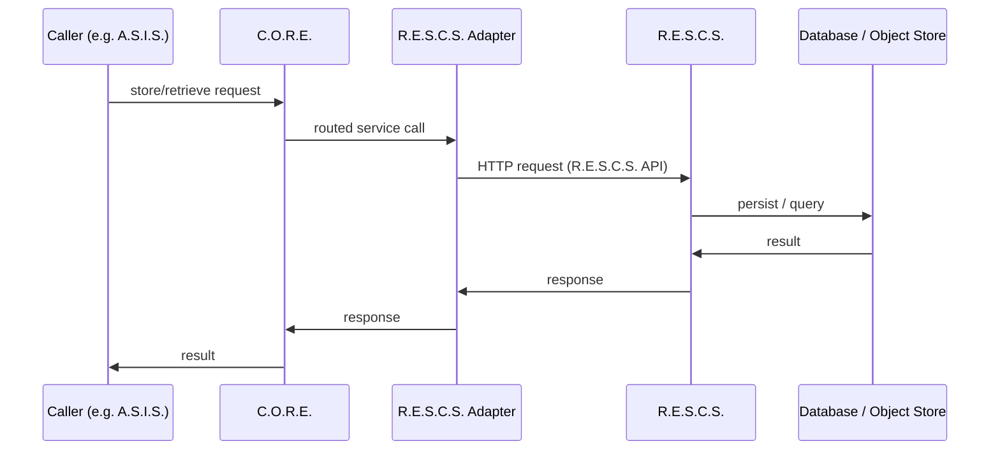

# Data Flow

> [!NOTE] **Status:** Data ownership is fixed by the architecture. Current implementation is limited to what each system has already built (see status markers throughout and in [`systems/`](../systems/)).

## Purpose

This document describes **where data lives and flows**. It is a companion to [Communication Flow](communication-flow.md) (the message layer) and [System Boundaries](system-boundaries.md) (ownership).

## 1. Data ownership

| Data | Owner | Storage | Status |
|---|---|---|---|
| C.O.R.E. runtime/operational state (configuration, resources, health, events) | **C.O.R.E.** | Local, in-process-visible; configuration in YAML + env (`config/core.yaml`, `CORE_*` overrides) | **IMPLEMENTED** |
| C.O.R.E. durable records (device identities, runtime history) | **C.O.R.E.** (creates/reads) → **R.E.S.C.S.** (authoritative store) | Persisted through the `RescsAdapter` boundary (`var/rescs.json` file adapter in dev; HTTP adapter against R.E.S.C.S.) | **IMPLEMENTED** (adapter boundary; deployed interop pending external validation) |
| Records (structured data) | **R.E.S.C.S.** | R.E.S.C.S. database (SQLAlchemy; SQLite dev, PostgreSQL path ready) | **IMPLEMENTED** (HTTP API + auth enforced; live PostgreSQL deployment pending external validation) |
| Files / objects | **R.E.S.C.S.** | Object stores: local dir (default), memory, S3-compatible backend | **IMPLEMENTED** (real S3 provider not yet exercised) |
| Shared/cloud-backed data | **R.E.S.C.S.** | Cloud-backed (PostgreSQL/Supabase path implemented; encryption model delegated/documented) | **IMPLEMENTED** (external validation pending) |
| Distributed data (device-facing) | **R.E.S.C.S.** (authoritative) → **C.O.R.E.** (retrieves/normalizes/distributes) | C.O.R.E. `DataOrganizer` delivers to devices over device routing | **IMPLEMENTED** (in software) |
| A.S.I.S. memory (conversation context, remembered facts, user identity) | **A.S.I.S.** | Local (SQL file `MemoryDatabase` in the `asis` package) | **IMPLEMENTED** (local only) |
| A.S.C.S. task state | **A.S.C.S.** | Local workspace (`.ascs` persistence) | **IMPLEMENTED** (local only) |
| T.I.V.I.S.S. memory/identity | **T.I.V.I.S.S.** | Undefined (future) | **FUTURE** |
| RadarS.A.R.D. detections/alerts | **RadarS.A.R.D.** (produces) → **C.O.R.E.** (coordinates) | Undefined (future); reports flow to C.O.R.E. | **FUTURE** |

> [!NOTE] **Storage ≠ data.** R.E.S.C.S. is the storage *system*; it does not automatically own every byte in the ecosystem. A.S.I.S. memory is local to A.S.I.S. today. The future model may persist long-term ecosystem data through R.E.S.C.S., but that is not the current implementation.

## 2. The storage request path (intended)

**Current reality:** The storage request path is **implemented in software up to the caller**: R.E.S.C.S. exposes its `/api/v1` record/file API with enforced API-key auth, and C.O.R.E.'s `HttpRescsAdapter` consumes it under a machine-readable contract (both sides ship contract tests). Device-facing distribution of retrieved data through C.O.R.E.'s device routing is also implemented. What is **not** real yet: an A.S.I.S.-originated request (A.S.I.S. is not connected) and deployed cross-host interop (external validation pending).

## 3. Data flow rules

1. **Storage logic lives in R.E.S.C.S.** C.O.R.E. adapters translate requests; they never re-implement persistence.
2. **No data-plane coupling between A.S.I.S. and R.E.S.C.S.** A.S.I.S. reaches stored data through C.O.R.E. only.
3. **Sync/shared-data semantics are owned by R.E.S.C.S.** — its `docs/synchronization.md` and namespace model (reserved `RUNNABLES`/`Ops`/`IDEAS` namespaces for C.O.R.E.) define them (see [rescs.md](../systems/rescs.md)).
4. **Observability data** (health state, events, logs) is C.O.R.E.'s domain and stays with C.O.R.E.; radar detections are the exception, reported *into* C.O.R.E. by RadarS.A.R.D. for coordination.

## Related

- [Data ownership and caching decisions](../decisions/README.md)
- [R.E.S.C.S. system page](../systems/rescs.md)
- [A.S.I.S. system page](../systems/asis.md)
- [Integration Contracts](../interfaces/integration-contracts.md)