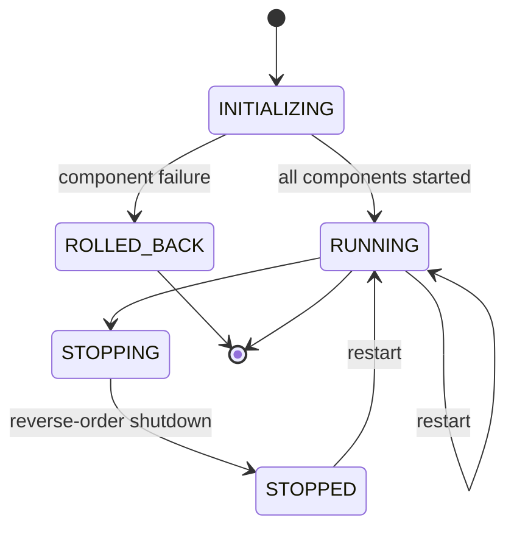

# Lifecycle

> [!NOTE] **Status:** C.O.R.E. runtime lifecycle (start/stop/restart ordering, rollback, events) is **IMPLEMENTED** and tested at the application level. Device lifecycle (register → presence → reconnect) is **IMPLEMENTED** in software with physical-LAN validation pending. Cross-system lifecycle policy is defined here and will be enforced as integrations land.

## Purpose

This document defines how R.I.S.A.R.M.S. components come to life, operate, and shut down — and how that should work across systems once integrations exist.

## 1. C.O.R.E. runtime semantics (implemented)

The `Runtime` orchestrates components with a dependency-aware start order (topological sort), reverse-order shutdown, failure rollback, and restart:

Key behaviors:

- **Start**: components initialize in dependency order; `SYSTEM_STARTED` emitted on success.
- **Stop**: reverse-order shutdown; `SYSTEM_STOPPED` emitted on completion.
- **Rollback**: a component failure rolls back already-started components so no partially-started system remains.
- **Restart**: returns to a healthy running state.
- **Application wiring**: `CoreApplication` builds a 13-component graph (configuration, logging, security, resources, organization, events, communication, routing, health, R.E.S.C.S., dependencies, services, runtime), wires services and health checks, then delegates to the `Runtime`.
- **Foreground control loop**: `python -m core … start` runs the engine interactively; `Ctrl+C` takes the normal shutdown path.

### Device lifecycle (v0.3.0, implemented in software)

External devices follow: authentication → registration → presence → discovery → routing/delivery → disconnect → offline → reconnect (same `device_id`/`identity_id`, new `connection_id`) → online. Device identities persist across C.O.R.E. restarts through the R.E.S.C.S. adapter boundary; restored devices wait offline for reconnect.

## 2. Application state machine (implemented reference)

The canonical state transition set used by C.O.R.E. (`core/runtime/state.py`): `initializing → running → stopping → stopped`, plus `rolled-back` on failure and `restarted` transitions. These states are the vocabulary agents should use when extending lifecycle behavior.

## 3. Cross-system lifecycle policy (target)

Once integrations exist, these rules apply:

1. **C.O.R.E. owns coordination.** It is the one system that orchestrates when other systems participate in ecosystem lifecycle tasks.
2. **Each system owns its own lifecycle.** R.E.S.C.S., A.S.I.S., etc., start/stop themselves; C.O.R.E. coordinates, it does not micromanage their internals.
3. **Ordering is dependency-driven.** A consumer starts after its dependencies (e.g., A.S.I.S. after C.O.R.E.; storage-using services after the R.E.S.C.S. adapter is reachable).
4. **Failure rolls back the dependent chain.** If a component that others depend on fails, dependents are stopped/held, never left half-running.
5. **Lifecycle is observable.** State transitions are events; health reflects lifecycle state (see [core.md](../systems/core.md)).

## 4. What is NOT implemented yet

- Cross-system lifecycle orchestration (A.S.I.S./R.E.S.C.S./C.O.R.E. start/stop as a group).
- Graceful handover during T.I.V.I.S.S. transfer (that is [FUTURE](../systems/tiviss.md)).
- Physical-LAN and 24/7 endurance validation of the implemented device lifecycle (deployment validation, not software).

## Related

- [C.O.R.E. system page](../systems/core.md) — device lifecycle and runtime semantics
- [Events contract](../interfaces/services.md) — lifecycle events
- [R.E.S.C.S. lifecycle](../systems/rescs.md) — app factory + lifespan
- [A.S.I.S. runtime](../systems/asis.md) — `asis.system` component/lifecycle model