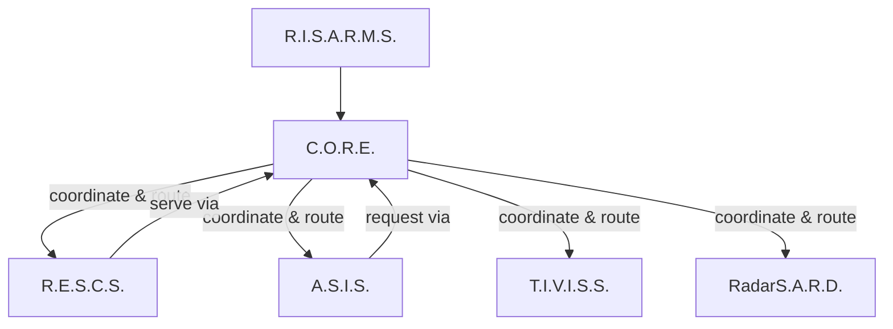
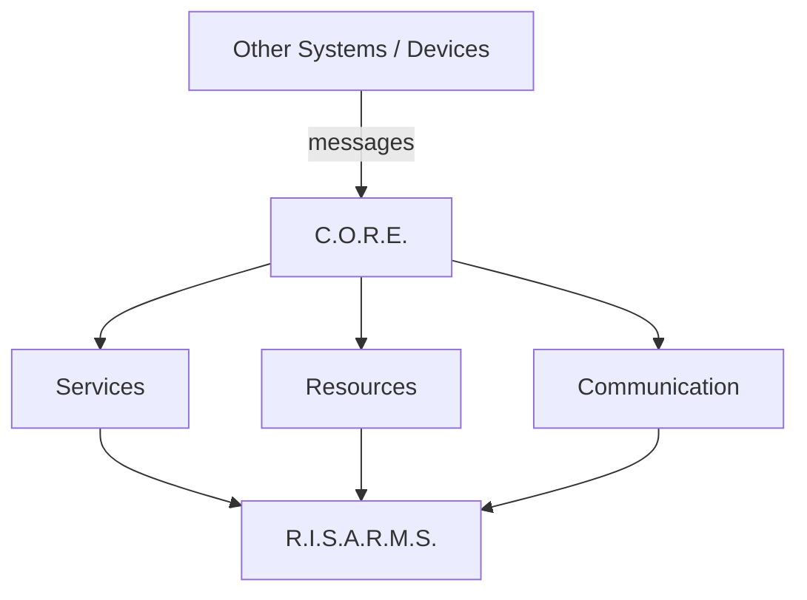

# Architecture Overview

> [!NOTE] **Status:** The architecture described here is the *target* architecture. Per-system implementation status is marked individually and defined below.

## Purpose

This document is the top-level view of the R.I.S.A.R.M.S. ecosystem. It defines:

- what R.I.S.A.R.M.S. is,
- how the systems fit together,
- the meaning of every arrow between systems,
- the vocabulary used to describe implementation status,
- and the principles that govern the whole architecture.

Detail lives in the sibling documents:

- [System Boundaries](system-boundaries.md) — who owns which responsibility
- [System Interactions](system-interactions.md) — who talks to whom and how
- [Data Flow](data-flow.md) — where data and records live
- [Communication Flow](communication-flow.md) — how messages travel
- [Lifecycle](lifecycle.md) — how systems start, stop and recover

## 1. Definition

**R.I.S.A.R.M.S.** — **R**ishik's **I**ntelligent **S**mart **A**dministration and **R**esource **M**anagement **S**ystem — is the ecosystem name for a set of cooperating subsystems:

| System | Expansion | Role |
|---|---|---|
| **C.O.R.E.** | Communication, Organization and Resource Engine | Central management and control engine |
| **R.E.S.C.S.** | Rishik's Efficient System for Cloud Storage | Cloud/data storage |
| **A.S.I.S.** | A Smart Intelligence System | Primary AI / intelligence layer |
| **T.I.V.I.S.S.** | Though I'm Vanquished, I'm Still Stronger | Separate AI agent (future, handover-oriented) |
| **RadarS.A.R.D.** | Radar Security, Anomaly Reconnaissance Device | Security and anomaly detection |

The systems are modular. They are independently developed. They are ultimately intended to operate as **one ecosystem**.

## 2. The ecosystem diagram



### What each arrow means

- **`R.I.S.A.R.M.S.` → `C.O.R.E.`** — the ecosystem exercises its management, communication and control functions *through* C.O.R.E. C.O.R.E. is the operational hub.
- **`C.O.R.E.` → subsystem** — C.O.R.E. is the coordinator: it routes requests, manages communication, governs lifecycle, and owns the shared security infrastructure for the flow. This is management/coordination, not ownership of the subsystem's core purpose.
- **`A.S.I.S.` → `C.O.R.E.`** — the AI layer issues requests (service calls, storage access, device control) to C.O.R.E. rather than reaching other systems directly.
- **`R.E.S.C.S.` → `C.O.R.E.`** — storage serves results back through C.O.R.E., and is invoked by C.O.R.E. on behalf of callers.

> [!NOTE] **Arrow direction ≠ implemented today.** These arrows describe intended architecture. What is implemented today is stated in each system's page under [`systems/`](../systems/) and in [System Interactions](system-interactions.md#3-implemented-vs-planned-by-pair).

### The conceptual inner diagram



C.O.R.E. receives traffic from the outside, then uses its services, resource registry and communication layer to act — and the result feeds back into the ecosystem.

## 3. Status vocabulary

Every feature or system in this documentation is labeled with one of four statuses. The labels are the single source of truth for "does this exist yet?".

> [!NOTE] **IMPLEMENTED** — the functionality exists in code and is verified by tests.

> [!NOTE] **IN DEVELOPMENT** — the functionality is actively being built; parts may work, parts may be incomplete.

> [!NOTE] **PLANNED** — the decision to build it has been made and the design is documented here; no code exists.

> [!NOTE] **FUTURE** — a longer-term aspiration; design intent only, not committed.

**Any sentence in this documentation that describes behavior carries one of these statuses.** "Planned as implemented" language is forbidden: if the behavior is described but marked PLANNED/FUTURE, it is not real yet.

## 4. Architectural principles

The following principles govern the entire ecosystem. See [Development Philosophy](../development/contribution.md) for the written policy.

1. **Modularity** — systems remain independently developable.
2. **Explicit boundaries** — each system has clearly defined responsibilities.
3. **No duplicated ownership** — every responsibility has exactly one clear owner (see [System Boundaries](system-boundaries.md#1-responsibility-ownership)).
4. **Contract-first integration** — systems communicate through explicit interfaces (see [Interface Contracts](../interfaces/communication.md)).
5. **Testability** — every major integration is testable independently (see [Testing](../development/testing.md)).
6. **Observable operation** — runtime state, health, events and failures are observable.
7. **Controlled dependencies** — subsystems never silently depend on implementation details of other systems.
8. **No fake functionality** — documentation never describes planned functionality as implemented.

## 5. System inventory and ownership (summary)

The full ownership table is in [System Boundaries](system-boundaries.md#1-responsibility-ownership). In brief:

| Responsibility | Owner |
|---|---|
| Communication, message protocols, routing | **C.O.R.E.** |
| Organization, resource registry, services | **C.O.R.E.** |
| Runtime/lifecycle, events, dependencies, configuration, health, logging | **C.O.R.E.** |
| Security infrastructure | **C.O.R.E.** |
| Cloud storage, persistent data, files, sync | **R.E.S.C.S.** |
| NLP, reasoning, response generation, voice interaction | **A.S.I.S.** |
| AI-agent identity/memory/permissions/handover | **T.I.V.I.S.S.** (future) |
| Detection and reporting of anomalies | **RadarS.A.R.D.** |

## 6. Current state vs future state (snapshot)

> [!NOTE] This snapshot is accurate as of the last documentation update and is maintained in [`development/roadmap.md`](../development/roadmap.md).

| System | Now | Next |
|---|---|---|
| **C.O.R.E.** | v0.1 foundation implemented; v0.2 in development (transport abstraction, routing-to-service execution, runtime orchestration, events, health, configuration-persistence already landed) | Complete the 13 v0.2 phases, culminating in R.E.S.C.S. adapter, external-device transport, real CLI lifecycle, and the integration test spine |
| **R.E.S.C.S.** | v0.1: health API, record/file repositories (memory + SQLAlchemy), database layer | Expose record/file HTTP API, enforce authentication, object storage, C.O.R.E. adapter |
| **A.S.I.S.** | Chat runtime (Ollama), memory, tool framework, event bus, partial voice input pipeline | Integrate voice pipeline, migrate Forza naming, define C.O.R.E. integration |
| **T.I.V.I.S.S.** | — | Define identity/ownership/handover model |
| **RadarS.A.R.D.** | — | Define sensor/detection scope |

## 7. Filesystem reality

The documentation governs these directories:

```text
RISARMS/
├── CORE/
├── RESCS/
├── ASIS/
└── DOCS/
```

> [!IMPORTANT] **Independence rule:** R.E.S.C.S. and A.S.I.S. are independent projects and must never be placed inside CORE. Integration occurs through interfaces and communication contracts, governed by [Integration Contracts](../interfaces/integration-contracts.md). Referenced in ADR [0001](../decisions/0001-rescs-independent-from-core.md) and [0002](../decisions/0002-asis-independent-from-core.md).

## Next steps

- Read [System Boundaries](system-boundaries.md) to learn exactly who owns what.
- Read [System Interactions](system-interactions.md) to learn how the systems connect.
- Read each system page in [`../systems`](../systems/) for detailed, current status.