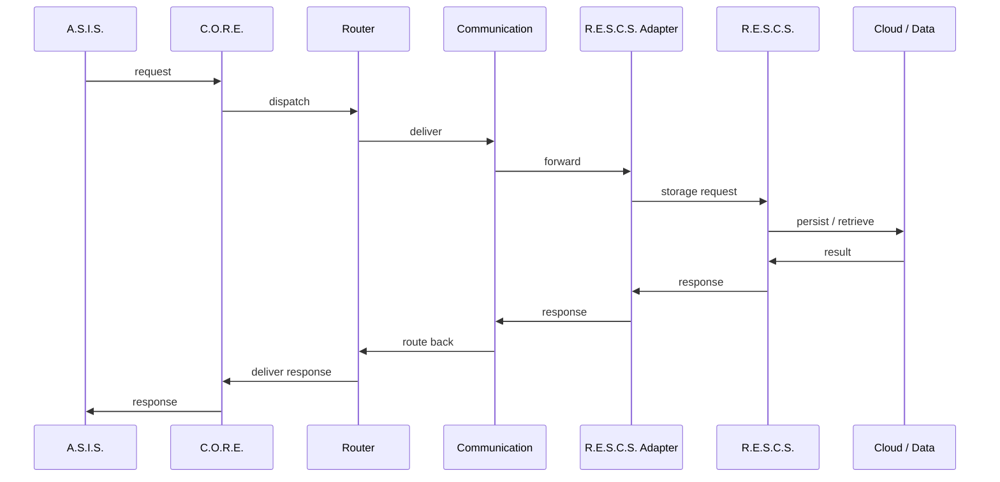

# System Interactions

> [!NOTE] **Status:** This document describes both the implemented and the intended interaction paths. Each edge is labeled **IMPLEMENTED**, **IN DEVELOPMENT**, **PLANNED** or **FUTURE**.

## Purpose

This document defines **who talks to whom** in R.I.S.A.R.M.S. and how. The governing model is that all cross-system traffic flows through C.O.R.E.

## 1. Interaction map

```mermaid
graph TB
    ASIS["A.S.I.S."]
    TIVISS["T.I.V.I.S.S."]
    RADAR["RadarS.A.R.D."]
    ASCS["A.S.C.S."]
    CORE["C.O.R.E."]
    SERVICE["Services"]
    ROUTER["Router"]
    COMM["Communication"]
    RESCS["R.E.S.C.S."]
    DEVICES["External Devices"]

    ASIS -->|requests (contract defined, no traffic)| CORE
    TIVISS -->|requests (future)| CORE
    RADAR -->|reports (future)| CORE
    ASCS -.->|future: reached via CORE| CORE
    CORE --> SERVICE
    CORE --> ROUTER
    CORE --> COMM
    SERVICE --> ROUTER
    ROUTER --> COMM
    COMM -->|HTTP adapter (implemented inside CORE)| RESCS
    COMM -->|TCP + TLS transport (implemented)| DEVICES
```

### Edge semantics

| Edge | Meaning | Status |
|---|---|---|
| A.S.I.S. → C.O.R.E. | A.S.I.S. requests services/storage/device action through C.O.R.E. | **PLANNED** (interfaces defined in A.S.I.S.; mock-only, no live traffic) |
| T.I.V.I.S.S. → C.O.R.E. | Same path, future agent | **FUTURE** |
| RadarS.A.R.D. → C.O.R.E. | Detection/alert reporting | **FUTURE** |
| A.S.C.S. ↔ C.O.R.E. | Coding capability mediated by C.O.R.E. | **FUTURE** (A.S.C.S. is standalone today) |
| C.O.R.E. internal (Services/Router/Communication) | Internal dispatch within C.O.R.E. | **IMPLEMENTED** (message → router → service flow tested) |
| C.O.R.E. → R.E.S.C.S. | Storage requests via `RescsAdapter` (`InMemory` / `File` / `Http`) | **IMPLEMENTED** in C.O.R.E. (`HttpRescsAdapter` + consuming contract tests); deployed cross-host interop not yet exercised |
| C.O.R.E. → Devices | External-device transport | **IMPLEMENTED** (TCP + TLS + token auth + device protocol); physical LAN validation pending |

## 2. Integration path (the canonical request flow)

The canonical end-to-end path is:



> [!NOTE] **Which parts are real today?** Inside C.O.R.E., `message → router → communication → service → response` is **IMPLEMENTED and tested**. The R.E.S.C.S. adapter chain (`HttpRescsAdapter` against R.E.S.C.S.'s implemented `/api/v1` API, with a machine-readable contract on both sides) is **IMPLEMENTED in software** and exercised by integration-test fixtures — but the A.S.I.S. entry point does not exist and deployed cross-host interop has not been run. The only missing segments of the canonical flow are therefore the A.S.I.S. request origin and physical deployment validation; do not represent the full A.S.I.S. → cloud round trip as live.

## 3. Implemented vs planned, by pair

### C.O.R.E. ↔ R.E.S.C.S.

- **Implemented (software):** R.E.S.C.S. ships a versioned `/api/v1` API with enforced `X-API-Key` auth and a machine-readable contract (`GET /api/v1/contract`, error-code table, reserved namespaces). C.O.R.E. ships `InMemoryRescsAdapter`, `FileRescsAdapter` and `HttpRescsAdapter` with fallback and health, and persists device identity/runtime history through this boundary. Contract-consuming tests exist on both sides.
- **Remaining:** deployed cross-host interop (CORE ↔ RESCS over a real network against live PostgreSQL/Supabase) has not been exercised; that is external validation, not missing code.
- Contract: [Integration Contracts](../interfaces/integration-contracts.md) and `RESCS/docs/core-integration-contract.md`.

### C.O.R.E. ↔ A.S.I.S.

- **Current:** A.S.I.S. runs as a standalone client (CLI, chat-capable AI layer, local memory). Its `integrations/core` package defines a `CoreClient` interface plus a `MockCoreAdapter`, but **no C.O.R.E.-side adapter for A.S.I.S. exists and no traffic flows**.
- **Planned:** A.S.I.S. issues request `Message`s to C.O.R.E. services through a defined contract; C.O.R.E. routes them (storage → R.E.S.C.S. adapter, device control → device transport). Note C.O.R.E.'s agent scheduler already reserves `asis-local`/`asis-offload` profiles — a naming hook, not an integration.

### C.O.R.E. ↔ External Devices

- **Implemented (software):** TCP + TLS transport (TLS 1.2+, fail-closed when misconfigured externally), token authentication, handshake/protocol negotiation with 0.2.x legacy support, device registration with persistence (via R.E.S.C.S.), discovery, presence, reconnection handling, device-to-device routing through C.O.R.E., structured device errors, connection/frame limits, and a stdlib external client with provisioning (`provision-device`).
- **Remaining:** physical Windows ↔ Mac LAN validation and 24/7 endurance.

### C.O.R.E. ↔ A.S.C.S.

- **Current:** none. A.S.C.S. is a fully standalone coding agent.
- **Future:** A.S.I.S./T.I.V.I.S.S. reach coding capability through C.O.R.E. No contract exists yet.

### C.O.R.E. ↔ RadarS.A.R.D.

- **Current:** No code.
- **Planned (FUTURE):** RadarS.A.R.D. detects and reports security/anomaly events; C.O.R.E. receives, coordinates, logs and acts.

### C.O.R.E. ↔ T.I.V.I.S.S.

- **Current:** No connected code (T.I.V.I.S.S. foundation is cloned locally at `TIVISS/` but still foundation-only; its adapters are local/mock interfaces).
- **Future:** T.I.V.I.S.S. requests through C.O.R.E.; C.O.R.E. respects T.I.V.I.S.S. identity/ownership model.

### A.S.I.S. ↔ R.E.S.C.S.

- **Never direct.** A.S.I.S. reaches storage through C.O.R.E.'s adapter, honoring the single-owner rule. (See also [Data Flow](data-flow.md).) A.S.I.S.'s local `integrations/rescs` placeholder explicitly reports R.E.S.C.S. as unavailable and falls back to local memory.

## 4. Interaction policy

1. No system talks to another system's internals — only through interfaces ([interfaces](../interfaces/communication.md)).
2. No system bypasses C.O.R.E. to reach another system.
3. Every future integration adds a contract first, then implementation (contract-first principle).

## Related

- [Communication Flow](communication-flow.md)
- [Data Flow](data-flow.md)
- [Integration Contracts](../interfaces/integration-contracts.md)
- [Systems](../systems/) per-system pages
