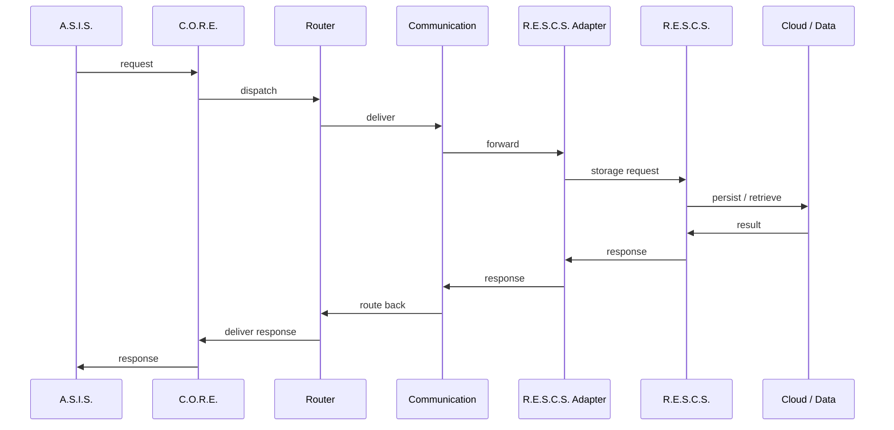

# System Interactions

> [!NOTE] **Status:** This document describes both the implemented and the intended interaction paths. Each edge is labeled **IMPLEMENTED**, **IN DEVELOPMENT** or **PLANNED**.

## Purpose

This document defines **who talks to whom** in R.I.S.A.R.M.S. and how. The governing model is that all cross-system traffic flows through C.O.R.E.

## 1. Interaction map

```mermaid
graph TB
    ASIS["A.S.I.S."]
    TIVISS["T.I.V.I.S.S."]
    RADAR["RadarS.A.R.D."]
    CORE["C.O.R.E."]
    SERVICE["Services"]
    ROUTER["Router"]
    COMM["Communication"]
    RESCS["R.E.S.C.S."]
    DEVICES["External Devices"]

    ASIS -->|requests| CORE
    TIVISS -->|requests (future)| CORE
    RADAR -->|reports (future)| CORE
    CORE --> SERVICE
    CORE --> ROUTER
    CORE --> COMM
    SERVICE --> ROUTER
    ROUTER --> COMM
    COMM -->|adapter (planned)| RESCS
    COMM -->|transport (planned)| DEVICES
```

### Edge semantics

| Edge | Meaning | Status |
|---|---|---|
| A.S.I.S. → C.O.R.E. | A.S.I.S. requests services/storage/device action through C.O.R.E. | **PLANNED** (A.S.I.S. currently standalone) |
| T.I.V.I.S.S. → C.O.R.E. | Same path, future agent | **FUTURE** |
| RadarS.A.R.D. → C.O.R.E. | Detection/alert reporting | **FUTURE** |
| C.O.R.E. → Services/Router/Communication | Internal dispatch within C.O.R.E. | **IMPLEMENTED** (message → router → service flow is tested; see [core.md](../systems/core.md)) |
| C.O.R.E. → R.E.S.C.S. | Storage requests via adapter | **PLANNED** (v0.2 Phase 9) |
| C.O.R.E. → Devices | External-device transport | **PLANNED** (v0.2 Phase 10) |

## 2. Integration path (the canonical request flow)

The canonical end-to-end path is:



> [!NOTE] **Which parts are real today?** Inside C.O.R.E., `message → router → communication → service → response` is **IMPLEMENTED and tested**. The A.S.I.S. entry point, the adapter, the R.E.S.C.S. storage call, and the cloud round-trip are **PLANNED** (v0.2 Phase 9 / A.S.I.S. integration work). Do not assume any part outside C.O.R.E.'s local message flow works yet.

## 3. Implemented vs planned, by pair

### C.O.R.E. ↔ A.S.I.S.

- **Current:** A.S.I.S. runs as a standalone interactive client (chat + local memory); it does not call C.O.R.E. and C.O.R.E. does not call it.
- **Planned:** A.S.I.S. issues request `Message`s to C.O.R.E. services through a defined contract; C.O.R.E. routes them (storage → R.E.S.C.S. adapter, device control → device transport).

### C.O.R.E. ↔ R.E.S.C.S.

- **Current:** Both projects exist. R.E.S.C.S. exposes a health API; C.O.R.E. has no adapter. **No traffic exists between them.**
- **Planned:** C.O.R.E. v0.2 Phase 9 adapter in C.O.R.E.; R.E.S.C.S. record/file HTTP API + auth enforcement on the R.E.S.C.S. side. Contract defined in [Integration Contracts](../interfaces/integration-contracts.md).

### C.O.R.E. ↔ RadarS.A.R.D.

- **Current:** No code.
- **Planned (FUTURE):** RadarS.A.R.D. detects and reports security/anomaly events; C.O.R.E. receives, coordinates, logs and acts.

### C.O.R.E. ↔ T.I.V.I.S.S.

- **Current:** No code.
- **Future:** T.I.V.I.S.S. requests through C.O.R.E.; C.O.R.E. respects T.I.V.I.S.S. identity/ownership model.

### A.S.I.S. ↔ R.E.S.C.S.

- **Never direct.** A.S.I.S. reaches storage through C.O.R.E.'s adapter, honoring the single-owner rule. (See also [Data Flow](data-flow.md).)

## 4. Interaction policy

1. No system talks to another system's internals — only through interfaces ([interfaces](../interfaces/communication.md)).
2. No system bypasses C.O.R.E. to reach another system.
3. Every future integration adds a contract first, then implementation (contract-first principle).

## Related

- [Communication Flow](communication-flow.md)
- [Data Flow](data-flow.md)
- [Integration Contracts](../interfaces/integration-contracts.md)
- [Systems](../systems/) per-system pages