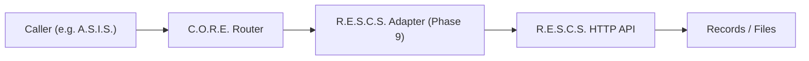

# Integration Contracts

> [!NOTE] **Status:** **PLANNED.** No cross-system integration exists in code today. This document is the working specification that future R.E.S.C.S./A.S.I.S./C.O.R.E. integration work must satisfy. Do not treat anything here as implemented.

## 1. Purpose

This document defines the contracts that will connect the independent systems without coupling them. It is the interface-level companion to [System Interactions](../architecture/system-interactions.md).

## 2. Principles (contract-first integration)

1. **Contract before code.** An excellent interface spec precedes implementation.
2. **Contract is the authority.** Given ambiguity, implement to the contract, then ask.
3. **No cross-system code coupling.** C.O.R.E. never imports R.E.S.C.S./A.S.I.S. internals, and they never import C.O.R.E. internals.
4. **The contract travels with the docs.** When the R.E.S.C.S. adapter lands (v0.2 Phase 9), the contract here and R.E.S.C.S.'s own `docs/core-integration-contract.md` must agree.

## 3. C.O.R.E. ↔ R.E.S.C.S. contract

### Direction of dependency
C.O.R.E. depends on R.E.S.C.S.'s **API contract**, not its implementation. R.E.S.C.S. exposes storage capability; C.O.R.E. brings a caller.

### Required behaviors (to be locked during Phase 9)
- **Record storage**: create, read, update, delete, list/get records.
- **File/object storage**: store, retrieve, delete files/objects.
- **Authentication**: R.E.S.C.S. will enforce API-key authentication; C.O.R.E. must present valid credentials ([Security](../security/overview.md)).
- **Correlation**: C.O.R.E. request IDs propagate into R.E.S.C.S. (X-Request-ID semantics), so cross-system tracing works.
- **Error mapping**: R.E.S.C.S. error codes map to C.O.R.E. message errors deterministically ([Messaging](messaging.md#4-errors)).
- **Health**: C.O.R.E. health reflects R.E.S.C.S. reachability/health via the adapter.

### Interface points
The C.O.R.E. side: a **R.E.S.C.S. adapter service** registered with C.O.R.E.'s router/services, reachable by message type. The R.E.S.C.S. side: its HTTP API (record/file endpoints — currently **PLANNED** in R.E.S.C.S.).

## 4. C.O.R.E. ↔ A.S.I.S. contract

### Required behaviors (to be locked during A.S.I.S. integration)
- **Service requests**: A.S.I.S. issues service requests to C.O.R.E. as messages with identity ([Identity](../security/overview.md#1-security-model)).
- **Storage via C.O.R.E.**: A.S.I.S. never calls R.E.S.C.S. directly; it requests storage through C.O.R.E. ([Data Flow](../architecture/data-flow.md)).
- **Device control (future)**: A.S.I.S. requests device actions through C.O.R.E.'s device transport.
- **Responses**: A.S.I.S. receives C.O.R.E. service responses correlated by request ID.

### What A.S.I.S. must NOT do
- Own routing/registry/lifecycle/security infrastructure of C.O.R.E.
- Reach other systems directly.

## 5. Evolving the contracts

- Any change to a cross-system contract is a **decision** — record it under [Decisions](../decisions/README.md).
- Version contracts explicitly ([Versioning](../development/versioning.md)).
- A contract change that breaks a caller is a breaking change regardless of which system defines it.

## Related

- [Communication Contract](communication.md)
- [R.E.S.C.S. system page](../systems/rescs.md)
- [A.S.I.S. system page](../systems/asis.md)
- [ADR 0005 — Storage integration via adapter](../decisions/0005-storage-integration-via-adapter.md)
- [Data Flow](../architecture/data-flow.md)