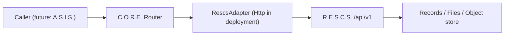

# Integration Contracts

> [!NOTE] **Status:** The **C.O.R.E. ↔ R.E.S.C.S. contract is IMPLEMENTED** on both sides (machine-readable contract served by R.E.S.C.S. at `GET /api/v1/contract`; consumed in C.O.R.E. by the `RescsAdapter` family with contract-consuming tests). The A.S.I.S. and device sections below are **PLANNED/FUTURE** as caller-facing contracts. Deployed cross-host interop between C.O.R.E. and R.E.S.C.S. is implemented but not yet externally validated.

## 1. Purpose

This document defines the contracts that connect the independent systems without coupling them. It is the interface-level companion to [System Interactions](../architecture/system-interactions.md).

## 2. Principles (contract-first integration)

1. **Contract before code.** An excellent interface spec precedes implementation.
2. **Contract is the authority.** Given ambiguity, implement to the contract, then ask.
3. **No cross-system code coupling.** C.O.R.E. never imports R.E.S.C.S./A.S.I.S. internals, and they never import C.O.R.E. internals.
4. **The contract travels with the docs.** The contract in this repository and R.E.S.C.S.'s own `docs/core-integration-contract.md` describe the same implemented surface and must agree.

## 3. C.O.R.E. ↔ R.E.S.C.S. contract — IMPLEMENTED

### Direction of dependency

C.O.R.E. depends on R.E.S.C.S.'s **API contract**, not its implementation. R.E.S.C.S. exposes storage capability; C.O.R.E. brings the caller. R.E.S.C.S. never initiates calls into C.O.R.E. Neither project imports the other.

### Implemented behaviors

- **Record storage**: create, read, update, delete, list/search records over `R.E.S.C.S./api/v1` with etag-based optimistic concurrency.
- **File/object storage**: store, retrieve, delete files/objects; streaming and resumable uploads for large payloads.
- **Authentication**: R.E.S.C.S. **enforces** `X-API-Key` (min 16 chars, constant-time compare) on protected routes; C.O.R.E. presents credentials per its adapter configuration.
- **Correlation**: R.E.S.C.S. echoes `X-Request-ID` on every response (configurable header), so cross-system tracing works.
- **Error mapping**: R.E.S.C.S. returns a stable error envelope (`{"error": {"code", "message", "details"}}`) with a documented code → C.O.R.E.-reaction table (`UNAUTHORIZED`, `FORBIDDEN`, `QUOTA_EXCEEDED`, `NOT_FOUND`, `CONFLICT`, `PRECONDITION_FAILED`, `PAYLOAD_TOO_LARGE`, `VALIDATION_ERROR`, `STORAGE_ERROR`, `DEPENDENCY_UNAVAILABLE`). See [Messaging errors](messaging.md#4-errors).
- **Runtime discovery**: `GET /api/v1/contract` returns the contract as data, so C.O.R.E. does not hard-code capabilities.
- **Namespaces**: records live under `(namespace, key, owner)` with reserved ecosystem namespaces (`RUNNABLES`, `Ops`, `IDEAS`) for C.O.R.E.-persisted operational state.
- **Health**: C.O.R.E. health includes R.E.S.C.S. adapter reachability; R.E.S.C.S. exposes `/health/live` and `/health/ready`.

### Adapter implementations (C.O.R.E. side)

```text
RescsAdapter
├── InMemoryRescsAdapter   (tests, deterministic runtime)
├── FileRescsAdapter       (var/rescs.json — dev persistence)
└── HttpRescsAdapter       (real HTTP to R.E.S.C.S.; endpoint, timeout, fallback, health)
```



> [!IMPORTANT] **Persisted-device rule:** C.O.R.E. persists device identity and runtime history *through* this boundary. R.E.S.C.S. remains the persistence authority; C.O.R.E. never creates a second device database.

### Remaining for full confidence

Deployed cross-host interop (C.O.R.E. → R.E.S.C.S. over a real network against live PostgreSQL/Supabase) is implemented but not yet exercised — external validation, not missing code.

## 4. C.O.R.E. ↔ A.S.I.S. contract — PLANNED

- **Service requests**: A.S.I.S. issues service requests to C.O.R.E. as messages with identity ([Identity](../security/overview.md#1-security-model)). A.S.I.S. already defines a local `CoreClient` interface + `MockCoreAdapter`; the real adapter awaits the locked contract.
- **Storage via C.O.R.E.**: A.S.I.S. never calls R.E.S.C.S. directly; it requests storage through C.O.R.E. ([Data Flow](../architecture/data-flow.md)). A.S.I.S.'s `integrations/rescs` placeholder deliberately reports R.E.S.C.S. as unavailable until this contract exists.
- **Device control (future)**: A.S.I.S. requests device actions through C.O.R.E.'s implemented device transport.
- **Agent scheduling note**: C.O.R.E.'s scheduler already defines `asis-local` / `asis-offload` agent profiles — a naming reservation for this integration, not an implemented path.
- **Responses**: A.S.I.S. receives C.O.R.E. service responses correlated by request ID.

### What A.S.I.S. must NOT do

- Own routing/registry/lifecycle/security infrastructure of C.O.R.E.
- Reach other systems directly.

## 5. External-device contract — IMPLEMENTED (software)

The device-facing contract is implemented in C.O.R.E. and out of scope for this page's detail; see [core.md](../systems/core.md) (handshake, registration, discovery, error messages, TLS/token requirements, limits) and [Trust Boundaries](../security/trust-boundaries.md).

## 6. Evolving the contracts

- Any change to a cross-system contract is a **decision** — record it under [Decisions](../decisions/README.md).
- Version contracts explicitly ([Versioning](../development/versioning.md)). R.E.S.C.S. serves its contract as data so capability discovery stays versioned.
- A contract change that breaks a caller is a breaking change regardless of which system defines it.

## Related

- [Communication Contract](communication.md)
- [R.E.S.C.S. system page](../systems/rescs.md)
- [A.S.I.S. system page](../systems/asis.md)
- [ADR 0005 — Storage integration via adapter](../decisions/0005-storage-integration-via-adapter.md)
- [Data Flow](../architecture/data-flow.md)
