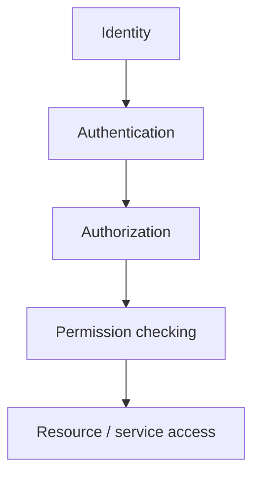

# Security Overview

> [!NOTE] **Status:** Security has moved beyond foundation level for **external-device communication**: C.O.R.E. enforces TLS 1.2+ and token authentication on external TCP (fail-closed when misconfigured), and R.E.S.C.S. enforces `X-API-Key` authentication with owner scoping on its API. However, this is **perimeter security for two specific boundaries** — it is not end-to-end ecosystem security. C.O.R.E.'s development configuration still ships with `security.enforce_authorization: false`, no cross-system identity federation exists, and A.S.I.S./A.S.C.S. have no network-facing security. Do not represent the ecosystem as a whole as production-secured.

## 1. Security model

The intended model:

| Layer | Purpose | Owner |
|---|---|---|
| Identity | Who is acting (system, agent, operator) | **C.O.R.E.** (security infrastructure) + per-system identity as needed (e.g. T.I.V.I.S.S.) |
| Authentication | Proving the identity is real (credentials) | **C.O.R.E.** (provider-based; deferred) |
| Authorization | Deciding what an identity may do | **C.O.R.E.** |
| Permission checking | Enforcing permissions on operations | **C.O.R.E.** |
| Resource/service access | Gate the actual access to resources/services | **C.O.R.E.** (via services contract) |

## 2. What exists today (verified, per system)

| System | Security artifacts | Reality |
|---|---|---|
| **C.O.R.E.** | `core/security`: `Identity`, `IdentityType`, `Permission`, `SecurityManager`, `SecurityPolicy`, pluggable **auth providers** (existence-based for internal/legacy; **token-based for external devices**); TLS 1.2+ on external TCP with fail-closed external binding; identity-spoofing rejection (`identity_id == connection.identity_id` enforced); config-gated service-dispatch authorization (`security.enforce_authorization`, default **false**) | **IMPLEMENTED for the external-device boundary** (real credential verification via token provider + TLS). Internal/development use keeps the existence-based provider and authorization enforcement off. |
| **R.E.S.C.S.** | `rescs/security.py`: `X-API-Key` requirement (`require_api_key`, `hmac.compare_digest`), authenticated principal, owner scoping (`enforce_owner`), optional single-owner lock mode (`RESCS_API_KEY_OWNER`) | **IMPLEMENTED and enforced** on the versioned API. Single shared key — not per-client identities. |
| **A.S.I.S.** | Permission levels, user-confirmation for dangerous operations, sandbox path resolution, secrets/validation helpers | **IMPLEMENTED** as local, single-user safeguards, not ecosystem security. No network-facing authentication. |
| **A.S.C.S.** | Local-only execution model (no code leaves the machine; explicit workspace; mode gating on tools) | **IMPLEMENTED** as a local tool boundary; no ecosystem security role. |
| **T.I.V.I.S.S.** | — | **FUTURE** — owns its own identity/permission/ownership model. |
| **RadarS.A.R.D.** | — | **FUTURE** — reports to C.O.R.E.; C.O.R.E. enforces handling permissions. |

> [!IMPORTANT] **Do not over-assume:** TLS+token (C.O.R.E. external) and API-key (R.E.S.C.S.) are the only enforced channel/credential mechanisms. There is still no cross-system identity federation, no per-client identity model in R.E.S.C.S., and no end-to-end authorization across ecosystem flows. Development configs deliberately run without authorization enforcement.

## 3. Who owns what (security)

- **C.O.R.E. owns the security infrastructure** — identities, authentication providers, authorization, and permission enforcement across the ecosystem flow.
- **Each system secures its own perimeter** consistent with the shared model — e.g., R.E.S.C.S. enforces its API key; A.S.I.S. guards its local tools.
- **Cross-system boundaries** are documented in [Trust Boundaries](trust-boundaries.md).

## 4. Security properties — where they stand

1. **Every external-device call authenticates** — **IMPLEMENTED** (TLS + token provider at the C.O.R.E. external boundary).
2. **R.E.S.C.S. perimeter authentication** — **IMPLEMENTED** (enforced `X-API-Key` + owner scoping).
3. **Every cross-system operation authorizes against the caller's permissions** — **PLANNED** (C.O.R.E. enforcement is config-gated off by default; no A.S.I.S./T.I.V.I.S.S. traffic exists to authorize).
4. **Request correlation survives end to end** (message/request IDs in [Messaging](../interfaces/messaging.md); R.E.S.C.S. echoes `X-Request-ID`) — **IMPLEMENTED** on the paths that exist.
5. **Failures are logged and observable; security events are emitted on the C.O.R.E. event bus** — **IMPLEMENTED** in C.O.R.E.
6. **Secret material is never hard-coded and never committed** — configuration/env only (both projects document this; RESCS keys/tokens/certs come from env/secret managers).
7. **No plaintext downgrade on external channels** — **IMPLEMENTED** (C.O.R.E. external TCP fails closed without valid TLS; localhost keeps legacy plaintext for 0.2.x compatibility).

## Related

- [Authentication](authentication.md)
- [Authorization](authorization.md)
- [Trust Boundaries](trust-boundaries.md)
- ADR [0006](../decisions/0006-security-architecture.md)