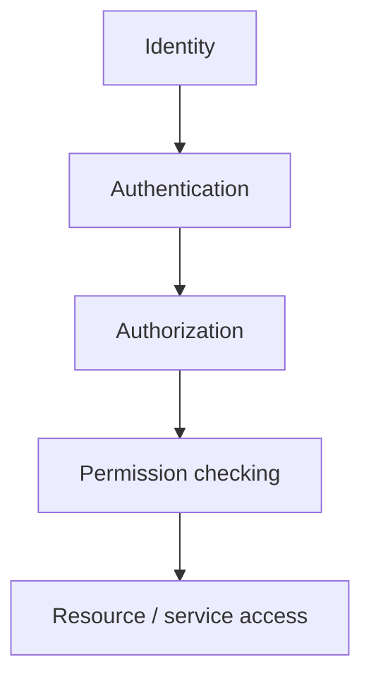

# Security Overview

> [!NOTE] **Status:** Security in R.I.S.A.R.M.S. is currently **foundation-level**. Only the base primitives exist. Production-grade security does **not** exist yet, and this document does not claim otherwise.

## 1. Security model

The intended model:

| Layer | Purpose | Owner |
|---|---|---|
| Identity | Who is acting (system, agent, operator) | **C.O.R.E.** (security infrastructure) + per-system identity as needed (e.g. T.I.V.I.S.S.) |
| Authentication | Proving the identity is real (credentials) | **C.O.R.E.** (provider-based; deferred) |
| Authorization | Deciding what an identity may do | **C.O.R.E.** |
| Permission checking | Enforcing permissions on operations | **C.O.R.E.** |
| Resource/service access | Gate the actual access to resources/services | **C.O.R.E.** (via services contract) |

## 2. What exists today (verified, per system)

| System | Security artifacts | Reality |
|---|---|---|
| **C.O.R.E.** | `core/security`: `Identity`, `IdentityType`, `Permission`, `SecurityManager` (register/unregister identities, authenticate, authorize, permission checks, metrics, event emission) | **IMPLEMENTED foundation.** `authenticate()` currently verifies identity *existence only*; credential verification is explicitly deferred to a dedicated authentication provider (v0.2 Phase 8). |
| **R.E.S.C.S.** | API-key configuration (`RESCS_API_KEY`, `X-API-Key` header contract) | Config validated, but **not enforced** — no middleware/dependency checks the header. |
| **A.S.I.S.** | Permission levels, user-confirmation for dangerous operations, sandbox path resolution, secrets helpers | **IMPLEMENTED** as local, single-user safeguards, not ecosystem security. |
| **T.I.V.I.S.S.** | — | **FUTURE** — owns its own identity/permission/ownership model. |
| **RadarS.A.R.D.** | — | **FUTURE** — reports to C.O.R.E.; C.O.R.E. enforces handling permissions. |

> [!IMPORTANT] **Do not assume:** No production-grade authentication, encryption, key management, or cross-system channel security exists today. Anything beyond the primitives above is **PLANNED** (primarily v0.2 Phase 8 and R.E.S.C.S. auth enforcement).

## 3. Who owns what (security)

- **C.O.R.E. owns the security infrastructure** — identities, authentication providers, authorization, and permission enforcement across the ecosystem flow.
- **Each system secures its own perimeter** consistent with the shared model — e.g., R.E.S.C.S. enforces its API key; A.S.I.S. guards its local tools.
- **Cross-system boundaries** are documented in [Trust Boundaries](trust-boundaries.md).

## 4. Intended security properties (PLANNED)

These are target properties, listed so future work has a checklist:

1. Every cross-system call authenticates (identity + credentials).
2. Every cross-system operation authorizes against the caller's permissions.
3. Request correlation survives end to end (message/request IDs in [Messaging](../interfaces/messaging.md)).
4. Failures are logged and observable; security events are emitted on the C.O.R.E. event bus.
5. Secret material (API keys, tokens) is never hard-coded and never committed — configuration/env only.

## Related

- [Authentication](authentication.md)
- [Authorization](authorization.md)
- [Trust Boundaries](trust-boundaries.md)
- [C.O.R.E. v0.2 Phase 8](../systems/core.md#phase-8-security-integration)
- ADR [0006](../decisions/0006-security-architecture.md)