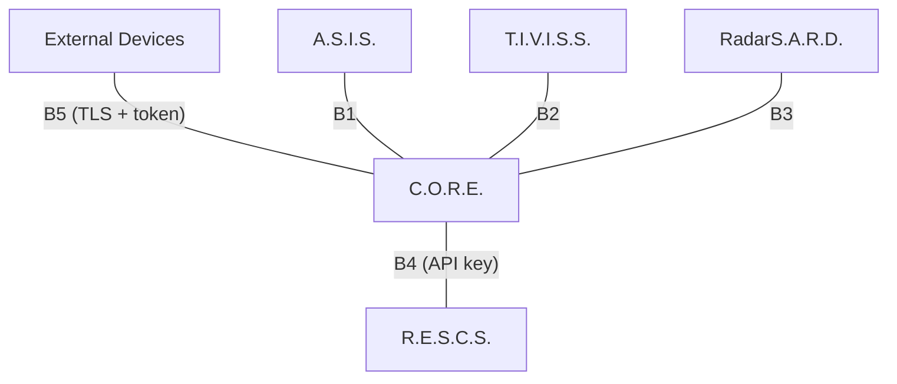

# Trust Boundaries

> [!NOTE] **Status:** The trust model below is the **target** architecture. Two boundaries now have **implemented, enforced security** (B4 C.O.R.E. ↔ R.E.S.C.S. and B5 Devices ↔ C.O.R.E., in software); the rest have no traffic at all. Physical LAN deployment of B5 has not yet been validated.

## 1. Purpose

A trust boundary is a point where the security model must re-validate: identity, authentication, authorization, and channel integrity. This document enumerates every boundary in the ecosystem.

## 2. Boundaries map

| Boundary | Between | Trust posture |
|---|---|---|
| **B1** | A.S.I.S. ↔ C.O.R.E. | External (independent project). A.S.I.S. is untrusted until authenticated/authorized at the boundary. |
| **B2** | T.I.V.I.S.S. ↔ C.O.R.E. | External, plus ownership/handover isolation; a transferred T.I.V.I.S.S. keeps its own identity profile. |
| **B3** | RadarS.A.R.D. ↔ C.O.R.E. | External sensor source; reports are untrusted until validated; RadarS.A.R.D. must not be able to mutate C.O.R.E. state directly. |
| **B4** | C.O.R.E. ↔ R.E.S.C.S. | External (independent project). API-key-authenticated; request correlation enforced; R.E.S.C.S. owns its perimeter. |
| **B5** | External devices ↔ C.O.R.E. | Least-trusted. Device inputs validated; commands authorized; device transport cannot impersonate C.O.R.E. |

## 3. Cross-boundary rules (target)

1. **No implicit trust.** Every boundary re-validates identity and authorization, even between ecosystem members.
2. **Least privilege.** Each actor gets the minimum permission set required by its role.
3. **Validation at the edge.** Payloads are validated and normalized at the boundary, never parsed by core logic as trusted.
4. **Correlation survives.** Request IDs cross boundaries so audit trails are continuous ([Messaging](../interfaces/messaging.md)).
5. **Detection is cooperative.** RadarS.A.R.D. reports into C.O.R.E.; C.O.R.E. decides and coordinates responses ([radar-sard.md](../systems/radar-sard.md)).

## 4. Current boundary inventory (reality check)

| Boundary | Exists today? | Today's posture |
|---|---|---|
| B1 A.S.I.S. ↔ C.O.R.E. | **FUTURE** | No traffic; A.S.I.S. standalone (interfaces + mock only). |
| B2 T.I.V.I.S.S. ↔ C.O.R.E. | **FUTURE** | No connected code (foundation is remote-only). |
| B3 RadarS.A.R.D. ↔ C.O.R.E. | **FUTURE** | No code. |
| B4 C.O.R.E. ↔ R.E.S.C.S. | **IMPLEMENTED** (software) | Implemented: enforced `X-API-Key` + owner scoping on R.E.S.C.S., request-ID correlation, stable error envelope, machine-readable contract. Deployed cross-host interop not yet exercised. |
| B5 Devices ↔ C.O.R.E. | **IMPLEMENTED** (software) | Implemented: TLS 1.2+ mandatory externally (fail-closed binding), token authentication, identity binding, registration required, frame/connection limits, structured errors. Physical LAN validation pending. |
| B6 A.S.C.S. | **FUTURE** | Standalone local tool; no ecosystem boundary exists. |

> [!IMPORTANT] **A boundary with code still needs its deployment validation.** B4/B5 enforcement is proven by automated tests, not yet by a physically deployed, hostile-network exercise. Do not describe them as production-hardened until then.

## Related

- [Security Overview](overview.md)
- [System Boundaries](../architecture/system-boundaries.md)
- [Integration Contracts](../interfaces/integration-contracts.md)
- ADR [0006](../decisions/0006-security-architecture.md)