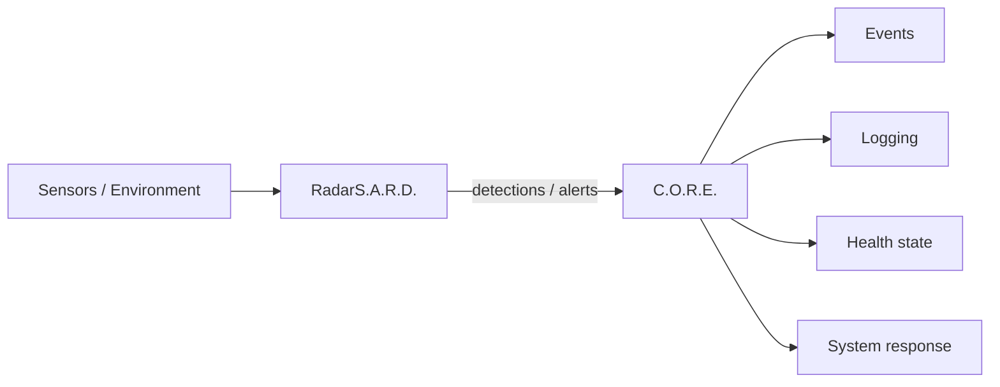

# RadarS.A.R.D. — Radar Security, Anomaly Reconnaissance Device

> [!NOTE] **Status:** **PLANNED / FUTURE.** No RadarS.A.R.D. repository exists — locally or on GitHub. This page documents design intent only.

## 1. What RadarS.A.R.D. is

RadarS.A.R.D. is intended to provide **security and anomaly detection** for the R.I.S.A.R.M.S. ecosystem.

## 2. Potential responsibilities

- Environmental monitoring
- Device monitoring
- Security monitoring
- Anomaly detection
- Intrusion detection
- Sensor integration
- Alert generation
- Security event reporting

## 3. The boundary that matters

> [!IMPORTANT] **RadarS.A.R.D. detects and reports. C.O.R.E. coordinates.**

The division of ownership is strict:

| Activity | Owner |
|---|---|
| Detect an anomaly / intrusion / deviation | **RadarS.A.R.D.** |
| Generate the security event / alert | **RadarS.A.R.D.** |
| Report the event into the ecosystem | **RadarS.A.R.D.** (through C.O.R.E.) |
| Coordinate the resulting events | **C.O.R.E.** |
| Logging, health state, system response | **C.O.R.E.** |

RadarS.A.R.D. is the *sensor layer*; C.O.R.E. is the *response layer*. RadarS.A.R.D. must not grow its own response/coordination machinery.

## 4. Integration path (future)

The precise alert contract is undefined until development starts; when it is defined, it follows the [Event contract](../interfaces/services.md) and [C.O.R.E. communication](../interfaces/communication.md) conventions.

## Related

- [System Boundaries](../architecture/system-boundaries.md)
- [Trust Boundaries](../security/trust-boundaries.md)
- [Development Roadmap](../development/roadmap.md)